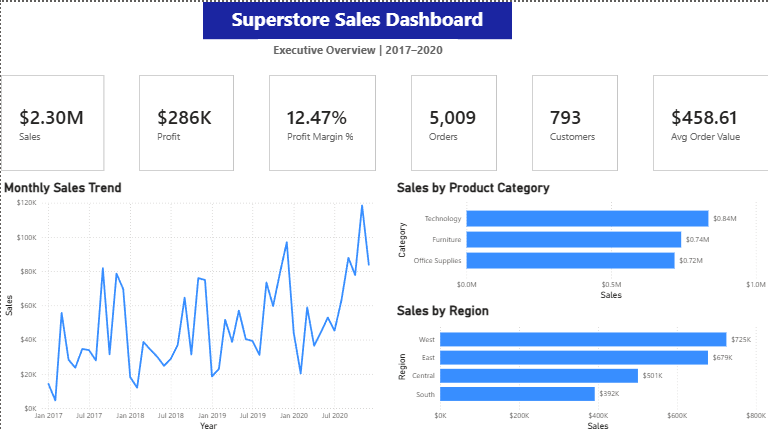
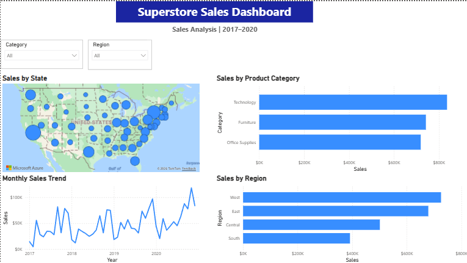
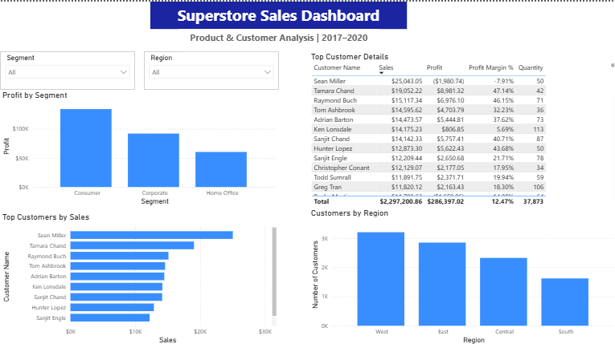

# NorthStar Sales Performance Analytics

## Project Overview

NorthStar Sales Performance Analytics is an end-to-end business analytics project that simulates a real-world engagement for **NorthStar Outfitters**, a fictional retail company specializing in outdoor equipment, apparel, and sporting goods across the United States.

Using **Python, SQL, Power BI, Tableau, and modern data analytics techniques**, this project transforms raw sales transaction data into actionable business insights through data cleaning, exploratory analysis, KPI development, interactive dashboards, and executive-level reporting.

The objective is to demonstrate the complete analytics workflow that a Data Analyst or Business Analyst would perform—from raw data to business recommendations.

---

# Dashboard Preview

## Executive Overview



---

## Sales Analysis



---

## Customer Analysis



---

# Business Questions

This project answers the following business questions:

- What is the company's total sales revenue?
- Which product categories generate the highest revenue?
- Which products generate the highest profit?
- Which geographic regions perform the best?
- Which states contribute the most sales?
- Who are the highest-value customers?
- How do customer segments differ in profitability?
- What sales trends exist over time?
- Which customers generate high revenue but low profitability?
- What business opportunities can improve overall performance?

---

# Dataset

**Sample Superstore Dataset**

The dataset contains approximately **9,900 retail transactions** spanning multiple years and includes:

- Orders
- Customers
- Products
- Categories
- Sales
- Profit
- Quantity
- Discounts
- Regions
- States
- Customer Segments

---

# Tools & Technologies

- Python
- Pandas
- NumPy
- Matplotlib
- SQL
- Power BI
- Tableau
- Excel / CSV
- Git
- GitHub
- Visual Studio Code

---

# Project Workflow

This project follows a complete business analytics workflow:

1. Business Requirements Gathering
2. Data Acquisition
3. Data Cleaning & Preprocessing
4. Exploratory Data Analysis (EDA)
5. SQL Business Analysis
6. KPI Development
7. Power BI Dashboard Development
8. Tableau Dashboard Development
9. Executive Business Reporting
10. Business Recommendations

---

# Key Analysis

The project includes:

- Data cleaning and preprocessing
- Exploratory Data Analysis (EDA)
- Revenue analysis
- Profitability analysis
- Customer analysis
- Product performance analysis
- Regional performance analysis
- KPI development
- SQL business queries
- Interactive Power BI dashboards
- Tableau visualizations
- Executive business reporting

---

# Key Insights

Key findings from the analysis include:

- Technology generated the highest overall sales revenue.
- The West region consistently outperformed other regions.
- Consumer customers generated the highest overall profit.
- Several high-revenue customers were unprofitable, highlighting potential pricing or discount optimization opportunities.
- Sales increased over time while maintaining an overall profit margin above 12%.
- Geographic analysis identified strong sales concentration across western and eastern states.

---

# Skills Demonstrated

### Data Analytics

- Data Cleaning
- Data Transformation
- Exploratory Data Analysis (EDA)
- Business Analytics
- Statistical Analysis
- KPI Development

### Programming

- Python
- Pandas
- NumPy
- SQL

### Business Intelligence

- Power BI Dashboard Development
- Tableau Dashboard Development
- DAX Measures
- Interactive Dashboards
- Data Visualization
- Executive Reporting
- Business Storytelling

### Professional Skills

- Business Requirements Analysis
- Problem Solving
- Decision Support
- Git Version Control
- Documentation

---

# Project Structure

```text
northstar-sales-performance-analytics/
│
├── dashboards/
│
├── data/
│   ├── raw/
│   └── cleaned/
│
├── docs/
│   └── business_requirements.md
│
├── notebooks/
│
├── reports/
│
├── sql/
│
├── src/
│
├── visuals/
│   ├── executive-overview.png
│   ├── sales-analysis.png
│   └── customer-analysis.png
│
├── .gitignore
├── README.md
└── requirements.txt
```

---

# Deliverables

This project includes:

- Cleaned sales dataset
- Python analytics workflow
- SQL business queries
- Exploratory Data Analysis (EDA)
- Power BI executive dashboards
- Tableau dashboards
- Executive business report
- Business recommendations
- Complete GitHub documentation

---

# Business Value

This project demonstrates how raw transactional data can be transformed into meaningful business intelligence.

The dashboards enable stakeholders to:

- Monitor company performance through KPIs
- Identify top-performing products and customer segments
- Analyze regional sales performance
- Detect profitability opportunities
- Support strategic business decision-making

---

# Results

This project successfully demonstrates an end-to-end analytics workflow using Python, SQL, Power BI, and Tableau.

The final solution showcases practical skills in data cleaning, analysis, dashboard development, KPI reporting, and business storytelling—mirroring the responsibilities of a professional Data Analyst.

---

# Future Enhancements

Potential future improvements include:

- Sales forecasting using Machine Learning
- Customer segmentation using clustering algorithms
- Inventory optimization analysis
- Marketing campaign performance analysis
- Automated reporting pipelines
- Cloud deployment (Azure / AWS)
- Real-time business intelligence dashboards

---

# Project Status

Completed project components:

- Business Requirements Document (BRD)
- Data Cleaning & Preprocessing
- Exploratory Data Analysis (EDA)
- SQL Business Analysis
- KPI Development
- Power BI Dashboard
- Tableau Dashboard
- Executive Business Report
- GitHub Documentation

---